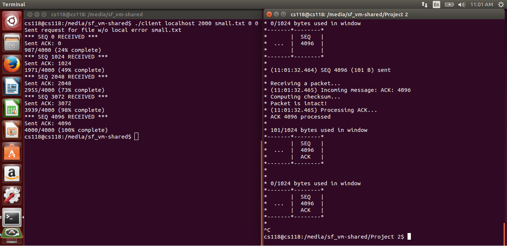

# Synopsis

Reliable UDP is a course-related project assigned in an upper-division networks <a href="http://www.lasr.cs.ucla.edu/classes/118_winter16/" target="_blank" title="COM SCI 118">class</a> at UCLA. A network layer is built on top of UDP to create a client-server interaction that exhibits reliable data transfer.

# Development

This project was tested in Ubuntu 14.04 LTS. 

Selective repeat is implemented to ensure reliable transfer of data between endpoints. Because the actual rate of packet loss and corruption in a local area network (LAN) may be too low, we created methods to simulate packet loss and corruption for testing purposes. 

# Installation

To compile and build this project, simply type the following in a Linux terminal:

    make

The Makefile compiles the code using g++.
